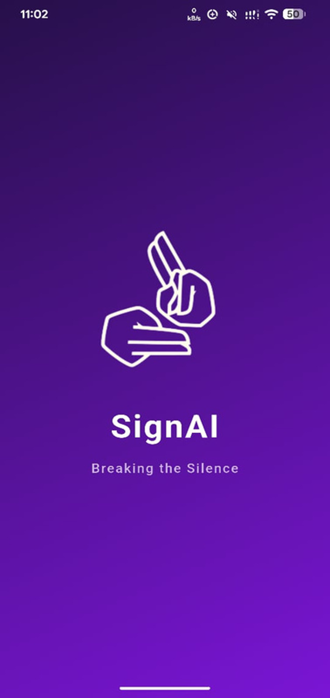

<h1 align="center">🤟 Sign AI — Download Hub</h1>

**The official download repository for the Sign AI mobile application.**

---

## 📥 Get the App

Sign AI is a real-time sign language translation tool designed to bridge the communication gap for the deaf and hard-of-hearing community. 

> **Note:** The source code for the mobile application is kept private for security reasons. This repository serves as the public hub for downloading the latest APK releases.

### 🚀 Download Latest Version

👉 **[Download Sign AI v0.9 (APK)](https://github.com/amr-ahmed-exe/Sign-AI-Releases/releases/latest)**

### 📱 Installation Instructions

1. Download the `Sign_Translator.apk` file from the [Releases page](https://github.com/amr-ahmed-exe/Sign-AI-Releases/releases).
2. Locate the downloaded file on your Android device.
3. Tap the file to install. If prompted, enable **"Install from unknown sources"** in your device settings.
4. Open **Sign AI** and start translating!

---

## ✨ Features

- **Real-Time Translation:** Point your camera to translate American Sign Language (ASL) to text instantly.
- **Bilingual Support:** Full support for both English (ASL) and Arabic (ArSL).
- **Text-to-Sign Avatar:** Type text and watch a 3D avatar perform the corresponding signs.
- **Dark Mode Support:** A beautiful UI that adapts to your system preferences.

---

## 📸 Screenshots

  <h3>✨ App Splash</h3>
  

 

  <h3>🌗 Light Mode vs Dark Mode</h3>

  
  &nbsp;&nbsp;&nbsp;
  

 

  
  &nbsp;&nbsp;&nbsp;
  

 

  
  &nbsp;&nbsp;&nbsp;
  

 

  
  &nbsp;&nbsp;&nbsp;
  

 

  
  &nbsp;&nbsp;&nbsp;
  

 

  
  &nbsp;&nbsp;&nbsp;
  

 

  
  &nbsp;&nbsp;&nbsp;
  

 

  
  &nbsp;&nbsp;&nbsp;
  

 

  
  &nbsp;&nbsp;&nbsp;
  

 

  
  &nbsp;&nbsp;&nbsp;
  

---

## 👨‍💻 Developer

**Amr A. El-Mokadam**  
*Graduation Project — Suez Canal University (Class of 2026)*  
[LinkedIn](https://www.linkedin.com/in/amr-ahmed-el-mokadam/) | [GitHub Profile](https://github.com/amr-ahmed-exe)
